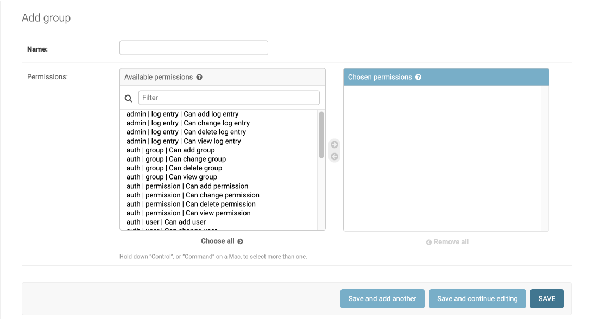
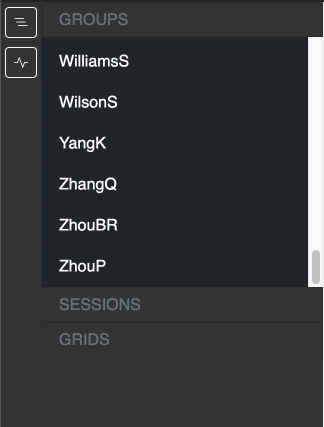

Groups are usually principal investigatiors under which the microscopy sessions will be saved. 

Only the [Users](./users.md) or staff members that are part of the group can access the sessions from the group.

## Creating a group

To create a group, select Groups in the admin portal and click Add Group. This will bring you to [http://localhost:48000/admin/auth/group/add/](http://localhost:48000/admin/auth/group/add/)

Creating a group will also create a directory with the same name in `/mnt/data/`. This is where all the SmartScope sessions from this group will be saved on disk.

!!! info "`/mnt/data/` "real" path"

    Remember that the path on your system attached to `/mnt/data` is defined in `smartscope.yml` during the installation process.

After creation, the group will show in the navigation panel at the side of the SmartScope browser

