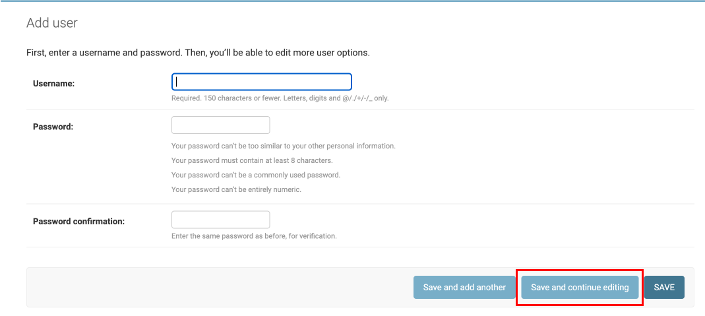
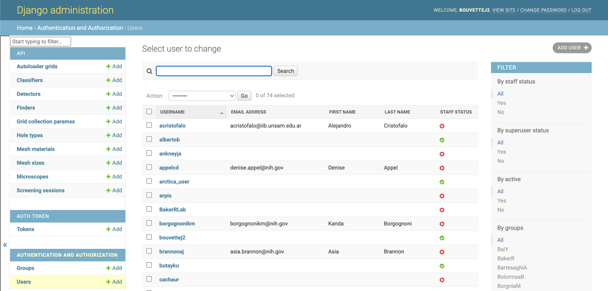
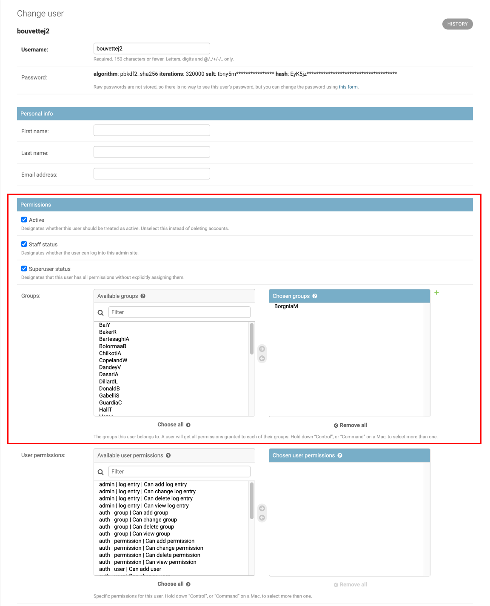

Users are created by admin users. Currently, the admin creates a password for the user during creation.
Password resets are also executed by the admins.

## Creating a user

1. To create a user, select Users in the admin portal and click Add User. This will bring you to [http://localhost:48000/admin/auth/user/add/](http://localhost:48000/admin/auth/user/add/)

2. Choose a username and password for the user and click `save and continue editing` to be redirected to the [edit user panel](#edit-user) and edit user permissions.

## Edit User

To edit a user, select Users in the admin portal and select the user to edit.

It will open the user details. The main part of this page is about the user permissions.

Users that are not `Staff` or `Superuser` need to be part of at least one group to browse any result within SmartScope.

!!! info "Staff and Superuser status"

    There is currently no difference between the two. Staff users will have the following permissions:
    
    * Access to the admin portal and ability to create and edit users and groups
    * Access to all smartscope sessions

