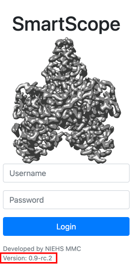

# Updating a Docker installation


This section outlines the steps to update your SmartScope installation with Podman/Docker

1. (Optional) Back up your database

    !!! warning

        This step is to protect your data in case the update fails.

    ```shell-session
    ## REPLACE YYYYMMDD by the current date ##
    sudo podman exec smartscope-db /bin/bash -c 'mysqldump --user=$MYSQL_USER --password=$MYSQL_ROOT_PASSWORD $MYSQL_DATABASE > /var/lib/mysql/YYYYMMDD_dump.sql'
    ```

2. Stop SmartScope

    ```shell-session
    cd /to/Smartscope/directory/
    ./smartscope.sh stop
    ```

3. Change version in `smartscope.yml`

    To update your docker installation open the `smartscope.yml` file
    ```shell-session
    vim smartscope.yml
    ```
    Edit the image line to a new version available in [GitHub container repository](https://github.com/NIEHS/SmartScope/pkgs/container/smartscope)
    ```yaml
    version: "3"
    services:
    smartscope:
      image: ghcr.io/niehs/smartscope:CHANGE_VERSION_NUMBER
      user: ${UID}:${GID}
      volumes: 
        ...
    ```

4. Restart smartscope

    ```shell-session
    ./smartscope.sh start
    ```

    The login screen should show the new version number

    
