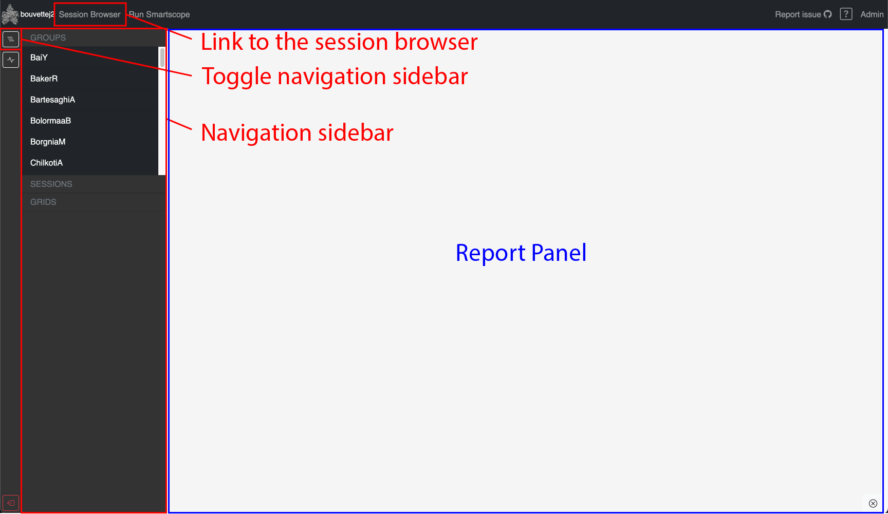
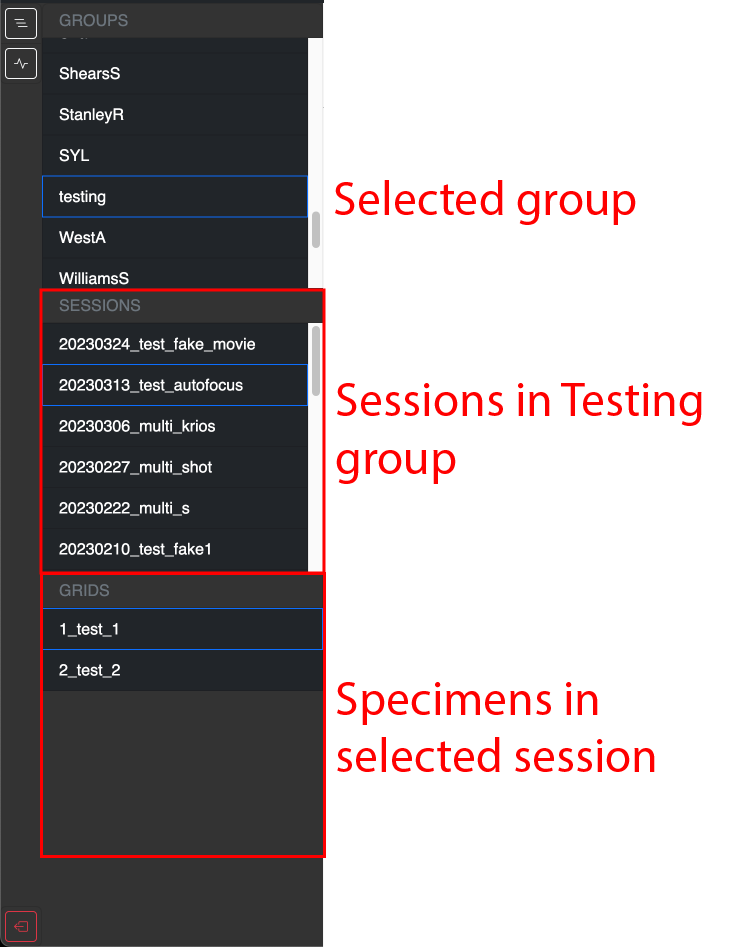

## Accessing the Session Browser

After logging in or selecting the `Session Browser` from the top of the screen, the navigation sidebar will appear at the left side of the screen. 

This panel is divided into three sections:

*	Groups: the groups that the current user is allowed to see
*	Sessions: the sessions that belong to a selected group
*	Grids: the grids that belong to a selected session

## Navigation

1. Select a group: It will populate the `SESSIONS` section with all the sessions from the selected group.
2. Select a session: It will porpulate the `GRIDS` section with all the grids from the selected session.
3. Selecting a grid will open the [Report panel]().

<!-- # Report Panel

The report panel contains most of the information for a selected grid.

*	Grid name
*	Grid status -> The last update time for a grid, if it has started or completed imaging.
*	Grid quality -> A togglable identifier that will change the text color in the side panel based on the quality of the grid.
*	Grid notes -> Text notes visible and modifiable by all users with session access.
*	Session Statistics -> The number of holes that are in the queue to be acquired and the number of holes that have been acquired.
*	Grid Details -> Parameters that were chosen during session set up. These can be changed for individual grids using this menu. Grid details can only be changed for grids that have not begun imaging. Grids that are currently being imaged will not be affected by these changes. 
*	Show Legend -> A guide to the automatic and manual labels assigned to squares and holes.
*	Grid images -> Atlas, square, and hole images.

## Report Panel Navigation

When selecting a specific grid, the report screen will show the grid name and any saved notes. These notes are visible and modifiable by anyone with access to the screening session. At the top right of the report panel are the grid quality buttons, and four collapsible menus.

### Collapsible Menus

There are four collapsible menus at the top of the report panel that provide different information for the grid.

*  Go To
    *  Curate Micrographs
    *  View Logs -> Quick link to the Session Information page for the grid

* Show Stats
   *  Holes in Queue -> Number of holes remaining in queue for the grid
   *  Holes Acquired -> Number of holes imaged on the grid
   *  Holes per Hour -> Average rate of imaged
   *  Holes in the Last Hour -> Number of holes imaged in the last hour

*  Grid Details
   *  Information on the collection parameters. These can be changed on the fly for grids that have not yet begun imaging

*  Show Legend
    *  Guide to color coding of squares and holes in the atlas and square images. Show Legend also contains a toggle for the number and square overlay on the atlas image.

### Atlas Image

The grid atlas appears on the left of the report panel with a 100 um scale bar in the bottom left of the image. When an atlas is taken, the square finder will automatically identify and classify grid squares. The classification system is visually represented by colored outlines.
*	Good -> blue
*	Bad -> red
*	Cracked/Broken -> purple
*	Contaminated -> teal
*	Fractioned -> cyan
*	Dry -> violet
*	In Queue -> orange
*	Currently Imaging -> Yellow
*	Acquired -> Green

Squares that have not been imaged will only appear with a colored outline. Squares that have been partially or completely imaged will be be outlined and have a yellow or green overlay, depending on if they have been completely imaged or not.

The square finder overlay can be removed by deselecting the Lables option in the General Toggle section of the Legend menu.

Hovering over a square with the mouse will overlay it with the color of their quality identifier (a cracked square will be highlighted purple, etc.), and clicking a square will fill in the square. This marks a square as selected. Clicking the square again will deselect it. You can select multiple squares at once.
Clicking the Clear Selection button at the top of the atlas image will deselect all squares.

A user can change the quality of a grid square at any time first by selecting it, clicking on the Selection Actions button at the top of the atlas image, and selecting the correct quality option from the drop-down menu. Multiple squares can be selected and changed at once.

During a live session, a user can add squares to the queue by selecting unqueued squares, clicking the Selection Action button, and selecting Add to Queue from the drop-down menu. A user can also dequeue squares by selecting queued squares, and selecting Remove from Queue from the Selection Actions menu.

*In the event that the Add to/Remove from Queue option is grayed out, be sure that you do not have already queued/unqueued squares selected.*

The atlas image can be maximized on the screen by pressing the + button at the top right corner of the image.

### Square Image

The square image will appear on the bottom right of the report panel after selecting a square that has either completed imaging (green overlay) or is in the process of being imaged (orange overlay).
The automatically assigned square number will appear at the top of the square image. A 10 um scale bar appears in the bottom right of the image.

The hole finder will automatically identify grid holes. The classification system is similar to the one used for grid squares and is likewise visible by clicking the Show Legend button at the top right of the report panel. 
*	Good -> Blue
*	Contaminated -> Light Green
*	Empty hole -> Gold
*	Bad/Thick Ice -> Orange
*	Cracked -> Pink
*   Missed Target ->
*	In queue-> Yellow
*	Currently Imaging-> Orange
*	Acquired -> Dark Green

The hole finder overlay can be removed by deselecting the Lables option in the General Toggle section of the Legend menu.

Hovering over a hole will overlay it with the color of its quality identifier (e.g. a cracked square will be highlighted pink) and clicking a hole will fill it in with its quality identifier color. This marks a hole as selected. Clicking a hole again will deselect it. You can select multiple holes at once.

Clicking the Clear Selection button at the top of the square image will deselect all holes.

The Square image can be maximized on the screen by pressing the + button at the top right corner of the image.

### Queueing Holes

A user can change the quality of a grid hole at any time by selecting it, clicking on the Selection button at the top of the square image, and selecting the correct quality option from the drop down menu. Multiple holes can be selected and changed at once.

During a live session a user can add holes to the queue by selecting unqueued holes, clicking the Selection button, and seleting Add to Queue from the drop down menu. A user can also dequeue holes by selecting queued holes and selecting Remove from Queue from the Selection menu.

*In the event that the Add to/Remove from Queue option is grayed out, be sure that you do not have already queued/unqueued holes selected.*

Every hole in a square may be queued or unqueued without selection by clicking the Queue all holes or Cancel all holes options from the All Holes drop down menu at the top of the square image.

When using image shift settings during imaging, holes will be automatically grouped to maximize the number of good quality holes. The center hole of a group will be used for alignment relative to a reference image, and will be marked with a thick, solid outline in its qualifier color. Holes that will be imaged shifted to are marked by a dotted outline in their qualifier color.

SmartScope will not image holes that are marked as being contaminated, empty, having bad ice, or cracked, but will use the designated center hole to align the image shift template regardless of quality.

The Regroup BIS option in the All Holes drop down menu can be used to more efficiently group holes after manually marking undesirable targets. This option maximizes the number of holes that will be imaged with one image shift.

### Adding Targets

In the event that the hole identifier fails to automatically recognize targets, such as on a continuous carbon or multi-A grid, a user can manually add targets. 

Shift-clicking at any point on the square image will add a red plus. Clicking the Add Targets button at the top of the square image will turn the red plus to a blue circle, marking it a good hole. Clicking the Clear Targets button instead will remove all red plusses.

Once a target has been added, it can be interacted with like any other hole. To queue an added hole, select it and add it to queue like any other hole.

### Hole Image

When a hole is queued or has completed imaging, it will be randomly assigned an identification number. During imaging, SmartScope will image squares and holes in ascending order.

Once a hole has completed imaging, the quality identifier will turn green, and selecting it will open the hole image at the bottom of the report panel. The automatically assigned hole number will be visible at the top of the hole image.

In the case that SmartScope is imaging multiple holes with an image shift template, all hole images of the group will appear on the right side of the hole image. When hovering the mouse over a hole image panel, the corresponding hole in the image shift will be highlighted in the square image.

The hole image also includes the power spectrum on the right, and information about the .tif file below, including the Defocus, CTFfit, Astigmatism, and tilt angle. The raw file name for the frames is at the bottom of the hole image panel.

At the top left of the image is a Rate down menu, allowing users to classify the micrographs and the hole. The classification system is visible by clicking the Show Legend button at the top right of the report panel. 
*	Good -> Blue
*	Contaminated -> Light Green
*	Empty hole -> Gold
*	Bad/Thick Ice -> Orange
*	Cracked -> Pink
*   Missed Target ->
*	In queue-> Yellow
*	Currently Imaging-> Orange
*	Acquired -> Dark Green

Clicking the + at the top right of a hole image will open a pop-up window with a larger view of the hole image and the power spectrum. At the top of the window is the full name of the hole, including grid name, square number, and hole number. Below this title are buttons that will change the quality of the hole. The filename for the .tif file of the hole appears at the very bottom of the window. -->

