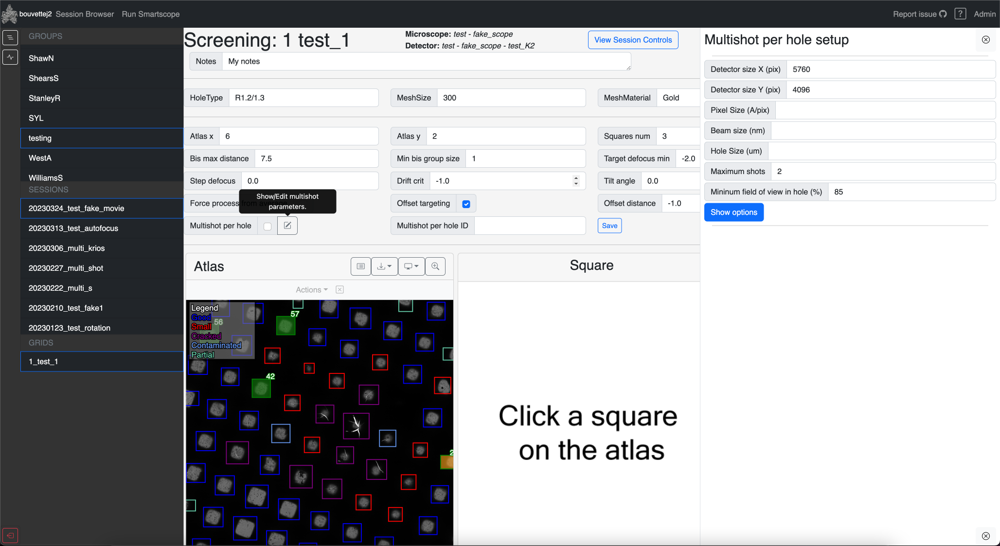
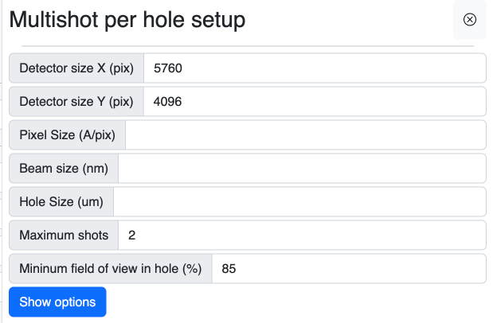
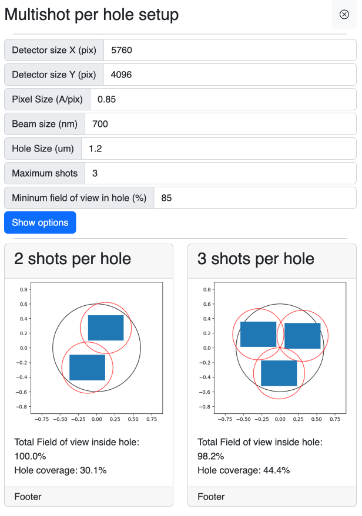
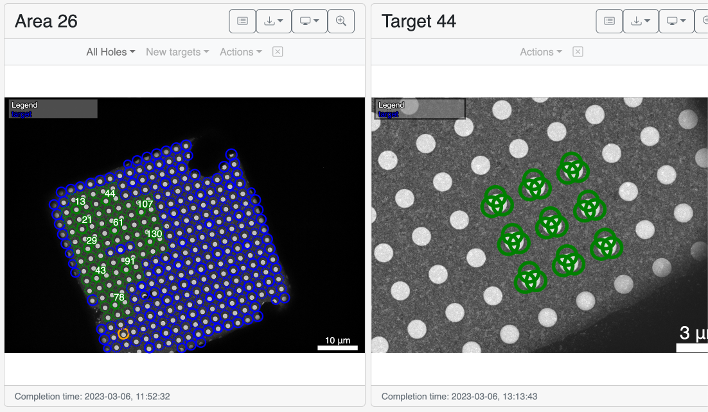

[:material-tag-outline: Added in 0.9]()

This feature allows to split every target/hole that was picked at the square level into multiple. This is mostly intended for high-throughput data collection on titan krios and cryoARM-300  and escpecilly on fringe-free microscopes.

## Set up

During a [session setup](/usage/preparation/setup_session) or in the [grid details](/usage/report/status_bar/#grid-details) of the report, you can enable and setup multishot. I consists of a checkbox and a button to bring the setup menu.

!!! warning 

    Enable multishot per hole only after doing the setup.

The setup menu is a right sidebar that will pop over the screen with a form to fill.

From the information in the form, smartscope will automatically calculate options on how to set up the shot within the given area.

!!! tip

    Hovering on the field name will show a help text on what the field does.

After filling the form, click on show options. Depending on the maximum of shots requested, it may take sereral seconds to return the choices.

Then, to select an option, click on the card and it will populate the multishot per hole ID field in the setup form.

At this point, you may close the multishot per hole menu, check the multishot per hole checkbox and save your new settings.

!!! note "Modifying the current grid does require a restart."

    Modifying the mutlishot per hole settings of the grid that is currently running will automatically incorporate the new changes at the next set of targets.

!!! note "Disabling and re-enabling"

    If you disable the mutlishot per hole after setting it up by unchecking the box, SmartScope will revert to one shot per hole.

    If you re-enable it later, it will resume with the previous multishot per hole settings. No need to set them again.

## Multishot per hole in Action

During the run, multishot per hole will be displayed in the medium mag card. The holes will have multiple targets over them.

