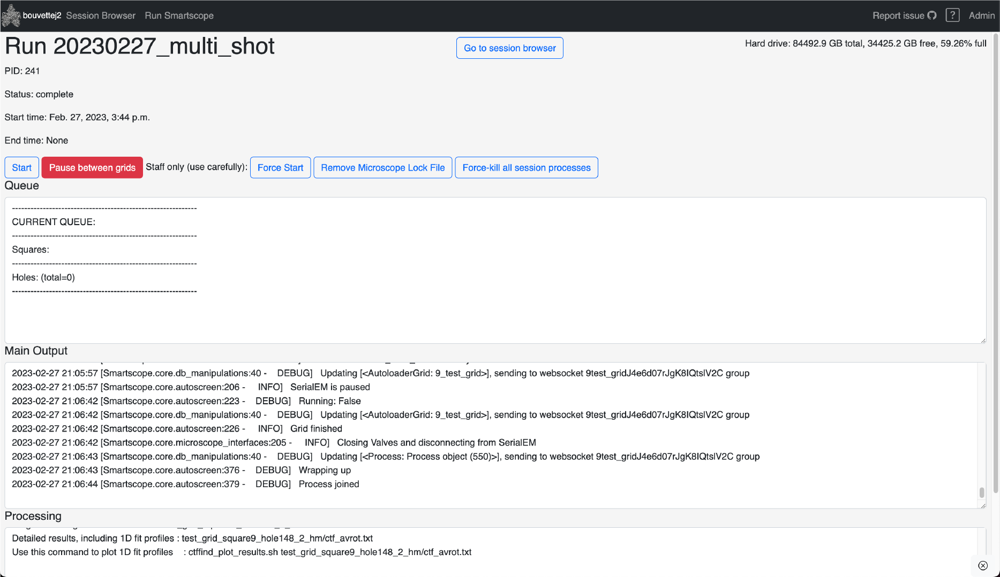
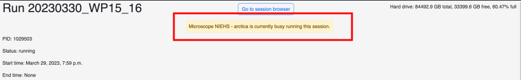
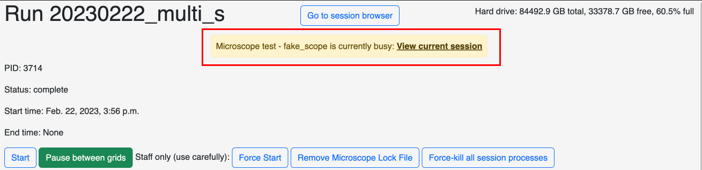
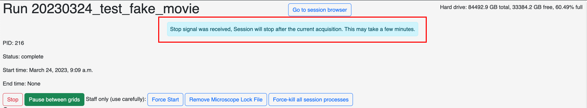

The run session page offers control over the automated SmartScope workflow as well as the logging information.

!!! note "Page automatic refresh"

    This page doesn't resfresh all the information properly and may require manual refresh to capture the entire updated information. It is on the roadmap for version 1.0.

## Top section

* Session name
* Go to session browser: Redirect to the browser to the report of the current session and grid.
* Hard drive monitor: Provides basic information about the status of the hard drive capacity.
* Process information: Provides basic information about the status of the session

## Control buttons

### Start/Stop
This is the main button to start and stop a run.

!!! note "How `Stop` works"

    The stop button will issue a soft stop signal and the run could take a few minutes to stop. Essentially, SmartScope will finish the current acquisition and stop when it queries the next item in the queue.

### Pause between grid

This toggle button with enable (green) or disable (red) an optinal prompt to pause before moving to the next grid. The goal is to allow users to verify the results and make sure they're satisfactory before moving to the next sample.

## Admin control buttons

These buttons will only appear when logged in as a staff user.

!!! warning "Use carefully"

    These buttons exists to get out a bad situations and should normally be avoided.

### Force start

In some cases, main due to errors and crashes, the process may not have cleaned up properly, resulting in the `Stop` button not reverting to `Start`. This button serves as an override to re-start the session.

### Remove scope lock file

When a run is started on a given microscope, a lock file is written to the file system. This prevents a second run to be started simultaneously, which would result in a crash. Again, in some error cases, the lock file may not get automatically removed. This button will force it's removal

!!! note "Protection against multiple overlapping sessions"

    When a run is started with a lock file present. A message will appear in the log that the microscope is locked and the process will terminate before initiating a connection to the microscope.

### Force-kill all session processes

Unlike the stop button, this button will immediately kill the SmartScope process and disconnect from the microscope. Use in case of emergency.

!!! warning

    This will probably results in not cleaning up the lock file or udpating the process status correctly. It is likely that the other 2 buttons will need to be used to restart.

!!! tip "Force-kill vs `Stop` button in SerialEM"

    Pressing this button is better than using the stop button in SerialEM because it will close the connection properly allow to restart. 
    
    However in case of major emergency, pressing the stop button in SerialEM will **immediately** break the connection between SmartScope and SerialEM. However, SerialEM will need to be closed and restarted to allow a reconnection.

## Logs

At the bottom of the page, there are 3 log panels. The top one displays the current items in the queue for imaging, the middle one follows the imaging process and the last one follows the image processing process.

### Pop-up notifications

There are multiple messages that may show up in the top sections during the run. Here's a list of them.

* Scope lock warnings: Notifies that the microscope bound to the session is currently being used. If the session that controls the lock is the one on the current page, a link to navigate to the current session with appear.

    

    !!! note "When browsing a different session"

        If you're looking at different session than the one that is currently running, the notification will still appear with a link to the current session.

        

* Stop signal received: After presseing the [stop button](#startstop), it notifies that the stop signal has been received and that the process will end after the current acquisition or set of acquisisions.

    

* Pause between grid prompt: This prompt appears when the screening is finished on the current grid and the [Pause between grid](#pause-between-grid) is enabled. The pop-up contains 2 buttons. On to continue the current grid and one to proceed to the next grid.

    

    !!! tip "Before Continuing the current grid"

        Before selecting `Continue current target`, more targets will need to be added to the queue. Otherwise, the prompt will immediately reappear without doing anything.
