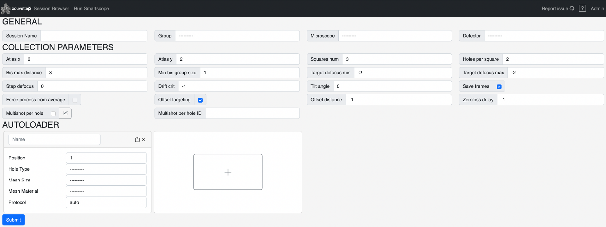

Clicking the `Run SmartScope` tab on the top navigation bar sends the user to a blank session setup page.

## Setup Smartscope

The session setup page includes three main sections: General, Collection Parameters, Autoloader.

## General

### Session Name

The name of the screening session for bookkeeping. The current date will be appended to the name automatically under the `YYYMMDD_SessionName` format.

###	Group

Group to which the session belongs. All Users that are part of the group will have access to the session.

###	Microscope

Microscope in which the specimens are loaded

###	Detector

Detector to be used on the microscope.

!!! warning "Known issue to be changed soon."

    The field is not filtered to show only the selected microscope's detectors. Be careful when selecting your detector if you want to avoid wierd behaviors.

## Collection Parameters

### Atlas

The axis follow the same axis as setting up a montage within SerialEM.

* `Atlas X`: Number of tiles in x for the Atlas image
* `Atlas Y`: Number of tiles in y direction for the Atlas image

### Automated area selection

* `Squares num`: Number of squares that will be automatically queued
* `Holes per square`: Number of holes that will be automatically queued.

!!! info "Selecting all holes"
    
    Enter `0` to select all available holes on a square and effectively enable data collection mode

!!! info "`Holes per square` with Beam-image Shift"
    
    If Beam-image shift grouping is enabled, it will select a number of groups rather than total holes, effectively yielding more images without adding too much time.

### Beam-Image Shift

Theses parameters are used to groups the holes or targets for beam-image shift (BIS). SmartScope will group all the holes within a grid square in the fewest amount of groups.

* `BIS max distance`: Maximum image shift distance in microns.
* `Min BIS group size`: Smallest number of holes to group in an image shift template.

!!! Example

    I have a R1.2/1.3 holey grid and would like to collect a 3X3 BIS pattern with groups of at least 3 holes or more, I would could use the following:
    
    * BIS max distance: ranging between 3.67 and 5.00 um. We usually use 4.
    * Min BIS group size: 3

### Defocus

* `Target defocus min`: Defocus value closest to zero
* `Target defocus max`: Defocus value furthest from zero
* `Step defocus`: Step to take when cycling defocus values. **Will not cycle if set to 0**

!!! info

    The Target Defocus values can be inverted during setup. SmartScope will sort them appropriately.

### Drift crit

Drift threshold in A/s before acquiring image. *-1 disables drift crit*

### Tilt angle

Angle of stage tilt.

This feature is mainly intended for single-tile data collection on samples presenting orientation bias. SmartScope will resolve the tilt geometry by applying a different image-shift and defocus value to keep the offplane targets in the right place and intended defocus range.

### Frames saving

* `Save frames`: Check whether to save the frames or just the average
* `Force process from average`: Will force the frames to be processed from average even when the frames are saved on Gatan Detector

!!! note "`Save frames` behavior on Gatan detectors"

    Saving the frames will disable early return, effectively accelarating collection by removing the processing overhead in SerialEM. Use the `Force process from average` to override this behavior and returning the image within SerialEM.

!!! note "`Force process from average` field disabled/unclickable?"

    By default, this option is disabled since it will have no effect on detectors from any other brands than Gatan. You may enable it in the `default_collection_params.yaml` file.

### Offset targeting

Will add an image-shift offset to sample different areas within each hole.

!!! tip "Why using offests?"

    * During screening, it can be useful to get an idea of the particle distribution all across the holes and even on the carbon mesh.
    * During data collection, there are times where the particles are moslty distributed more around the edge of holes, where the ice is thicker. In that case, you may specifify an offset to collect aree the areas off-centered.

* `Offset targeting`: Enable/Disable offset 
* `Offset distance`: If left to -1, will add a random offset on each acquisition depending on the specified hole type. If a value is specificed, the distance will be applied to all acquisitions. This is mainly useful for data collection where the particles tend to be at the edge of the holes.

!!! info "Data collection vs Screening behavior"

    * Screening: The random offsets are applied differently whether the mesh type is Carbon or Gold. The Carbon maximum image shift offset is higher than gold since there is valuable information about the sample that can be extracted from the what binds to the carbon.
    * Data collection: Even if offset targeting is enabled, no offset will be applied unless a value greater than 0 is specified in the `Offset distance` field.

### Zeroloss delay

[:material-tools: Fixed in 0.9]()

Delay in hours between zero-loss peak refinements. This will be ommitted if the microscope does not have an energy filter.

### Multishot per hole

[:material-tag-outline: Added in 0.9]()

Please read the detailed documentation about [setting up multishot per hole]().

## Autoloader

### Name

Name to be given to the grid.

!!! tip "Automatic numbering"

    If you have multiple grids with the same name but different numbers name it `gridName_1` and the number will be automatically increased when adding a new grid. This will only work with an underscore.

### Position

Position of the grid in the autoloader.

!!! info 

    The final name of the grid will be `position_gridName`

### Hole Type

Grid Type by hole spacing or other type is not holey substrate.

!!! warning

    This information should be accurate because some of the algorithms in the workflow depend on it.

### Mesh Size

Grid mesh size as from vendor specification. This parameter is not currently used in the worflow and is used for bookkeeping.

### Mesh Material

Whether it is a gold foil or carbon based.

!!! info

    This parameter is used during screening to determine the maximum [offset from center](#offset-targeting) that could be applied.

### Protocol

Place to select a specific protocol or use the automatic assignment `auto` as specified in the [default_protocols.yaml](/api/protocol/auto_protocol)

!!! info "Adding/removing grids"

    One autoloader template is available by default. More can be added by pressing the large `+` button to the right of the first template. Smartscope will automatically fill in the grid information based on the preceeding grid. The template can also be filled by pressing the clipboard button to the right of the grid name field. Grids can be removed by pressing the X button at the top right of the grid template.

## Submitting 

Once you have entered all of the information for the session, click on the Submit button. This will create the session and redirect to the [run session page](/usage/run_session)

