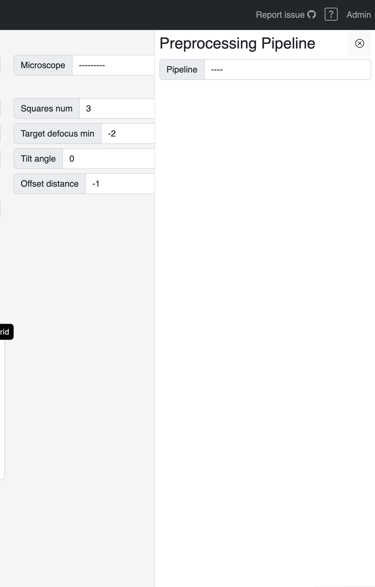

SmartScope has preprocessing capabilities. The preprocessing is a script that runs alongside the main SmartScope imaging workflow. It aims at processing the high-magnifications images and providing feedback from the data quality.

## Preprocesing Pipeline setup menu

[:material-tag-outline: Added in 0.91]()

There is now a menu to setup and control the preprocesssing pipeline. 

It can be accessed:

- During the [setup of a session](/usage/preparation/setup_session.md)
- In the grid report page using the `Show preprocessing` button in the [status bar](/usage/report/status_bar.md)

### During setup

!!! note

    Setting up a preprocessing pipeline is optional. It will use the default pipeline if no information is provided.

The menu will be blank when accessed during session setup since nothing was already set.

Then, choose a pipeline from the dropdown:

The form corresponding to the chosen pipeline will apprear, then click save and it will apply to all the grids in the session:

### On the grid report page

When accessing the preprocessing menu in the grid report page, it will automatically display the current setup.

This setup can be changed by changing the values and clicking save, as shown above.

!!! note 

    Changing the values will only apply to the currently selected grid, not all the grids in the session. 

### Controlling the propressing job

You will also notice a start and stop button to control the current process.

Clicking `start` will start the preprocessing process, even on a completed or aborted grid.

Clicking `stop` will signal the preprocessing to stop at the end of the current actions. 

!!! warning "Stop delays"

    Clicking stop may take a few minutes to complete since it needs to finish the process of the current batch of micrographs.

!!! tip

    Click stop before changing the preprocessing pipeline and then restart it to apply the new values.

