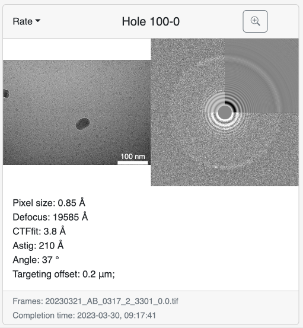
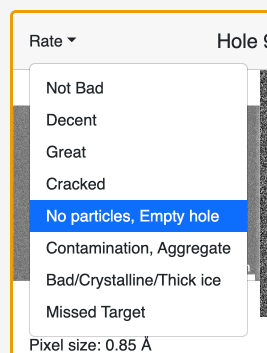
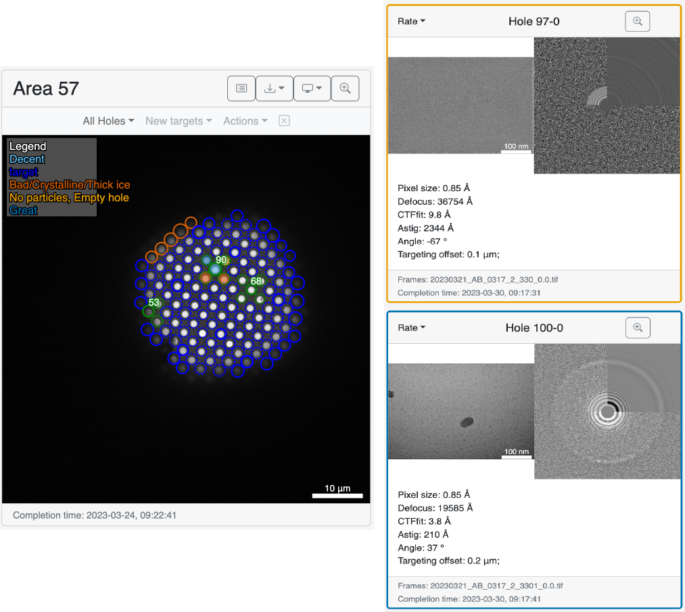

The high-magnification maps share similarities with the [low-magnification maps](../low_mag_maps).

[:material-tag-outline: Added in 0.91]()

Is is now possible to Download the high-mag images as for the low mag maps

### Rating exposures

The `Rate` Dropdown allows to give a descriptive rating to the images. They are currently mainly used for notes but may be used in the future as an interaction point. 

Rated micrographs will fill the holes in the saqure maps with the color associated with the rating. This helps when revisiting the grids at later points.

!!! tip "Hovering over a high-magnification map"

    When hovering over a high-magnification map, it will color the hole in the square and medium mag map with a fully opaque filling. It makes the hole registration easy to figure out from a qualitative point of view. 

### Metadata

The high-magnification cards include the metadata from CTFFIND4, as well as the pixel size of the acquisition and the targeting offset as set in the [collection parameters](/usage/preparation/setup_session/#offset-targeting).

Additionally, in the footer of the card, the name of the movie files containing the raw frames is there.

