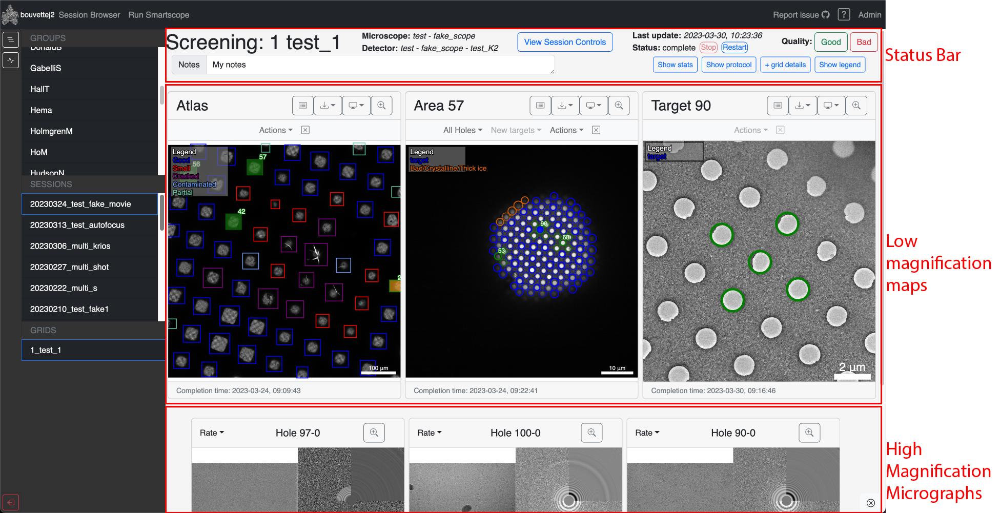

The report panel is the most important part of SmartScope. This is where all you can browser the images from a given grid and interact with the on-going session. There is a lot of information to unpack about everything that can be done. The next sections aim a describing all of the possibilities.

We can roughly split the Report panel in 3 sections, each of which will be described separately.

* Status Bar
* Low-magnification maps
* High-magnification Micrographs

