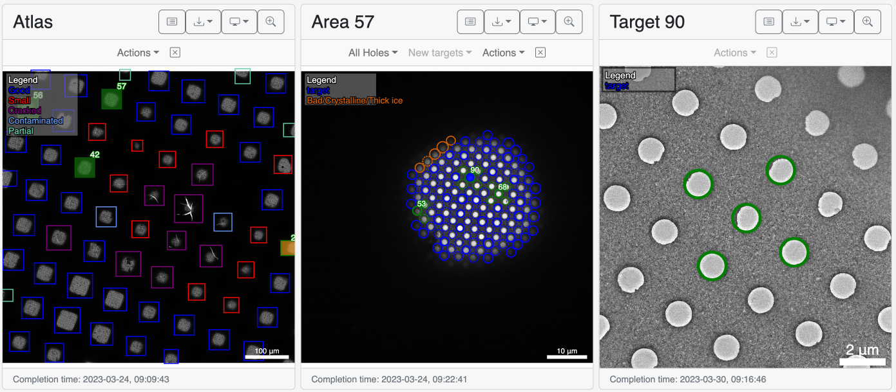
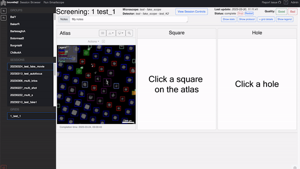
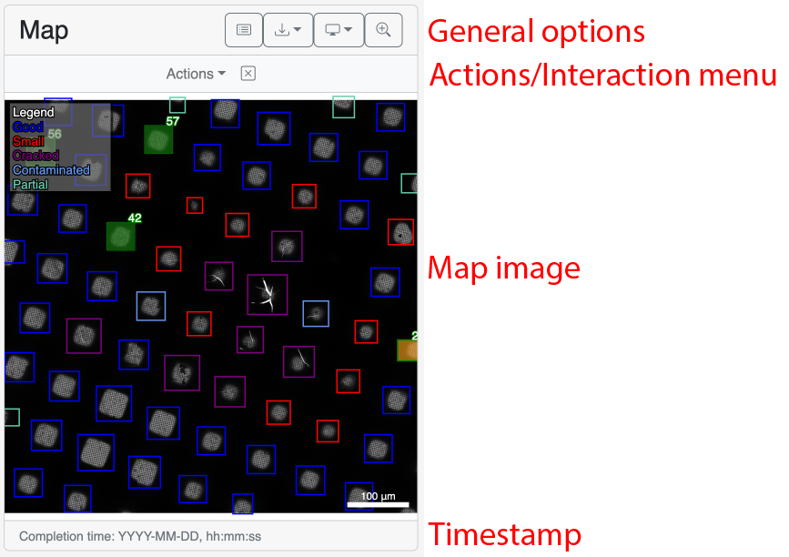
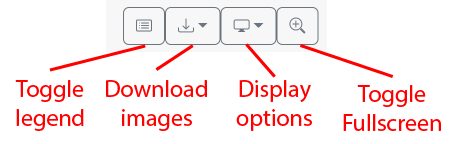
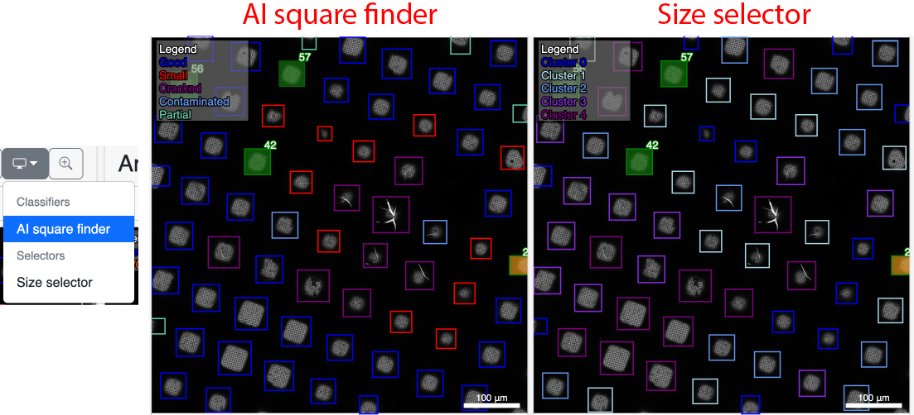
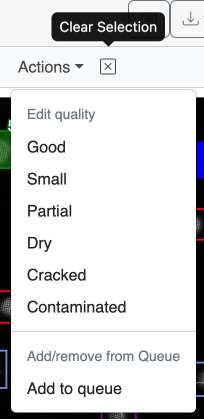
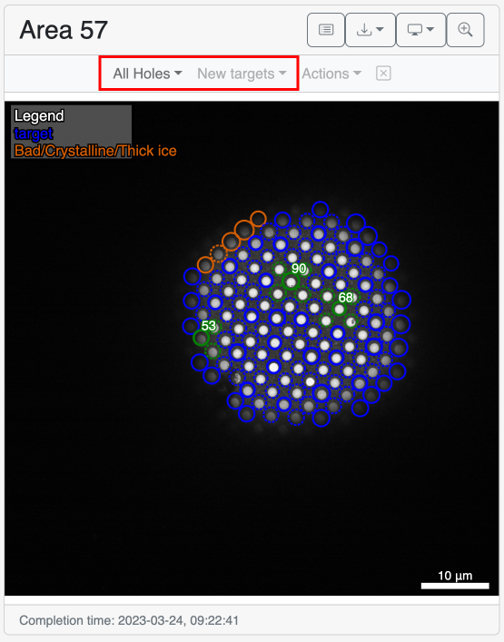
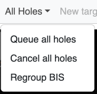
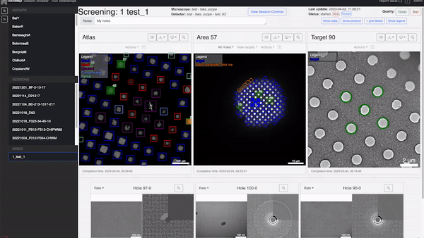
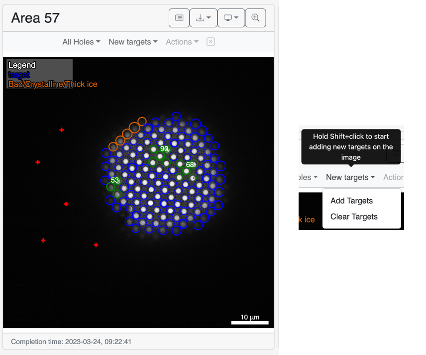

## Introduction

The low-magnification maps section is separated in 3 cards each corresponding to a different magnification level.

* Atlas (left): The lowest magnification where the squares are identified and selected.
* Square/Area (center): Magnification where the holes are identified. It corresponds to the Search preset in Serialem.
* Hole/Target (right): [:material-tag-outline: Added in 0.8]() This is the medium magnification where the hole coordinates can be refined.

## Navigating the magnification levels

It is only possible to access the upper magnification of an area/target that has been acquired. The can beeasily identified with their green ouline and number.

Clicking on them will open the next magnification images.

{ width="100%" }

## Map card

This section aims at describing the general properties of the low-magnification maps cards. They can be divided into 4 sections detailed below.

### General options

General options are available ot every magnification levels.

#### Toggle Legend
Will remove the legend and scale bar from the image to allow clicking items that may be hidden under them.

#### Download images
[:material-tag-outline: Added in 0.8]() 

Dropdown menu to download the image that is shown without the overlay in multiple file format. 

!!! note "Difference between `raw` and `.mrc`"

    The `.mrc` will be the stiched version of the montaged images like atlases while `raw` will be the the z-stacked montage that was produced by SerialEM.

#### Display options
Dropdowns menu to display the results from different algorithms on the map. The options will depend on the protocol and magnification level.

!!! example "Toggling between display options"

    

#### Toggle fullscreen
Will pop the map out of its position to occupy a larger fraction of the screen. Press again to bring it back to its original size.

### Actions/Interaction menu

The insteractions menu sits under the the general options and the amount of options vary between each mangification level. However, they all share the actions dropdown and the clear selection button.

#### Target acquisition status

There are a few status that a given target can have which will change it's color. As a rule of thumb a target with its number showing in the corner has an `active` acquisition status. Then, its color gives an indication of status:

* Orange: In the acquisition queue or `Queued`
* Yellow: Actively being aquired (`Started`) or pending processing (`Acquired`).
* Green: `Completed`. This means the target has been acquired and can be clicked to access the next magnification.

#### Selecting an modifying targets

To enable the Action dropdown, at least one target should be selected.

Clicking on the actions button will bring a few options change the label given to a hole and, if the grid status is `started`, you may also add or remove the target(s) from the acquisition queue depending on its/their status.

!!! note "Changing the acquisition status in bulk"

    To add/remove multiple targets from the queue at once, you need to select targets from only one type of status. For example, select only squares that are not in the queue and remove them all at once and vice versa.

!!! tip "Ensure that the selection is cleared before starting a new selection"

    It is always preferable to use the `Clear Selection button` next to the Actions dropdown before starting a new selection to have a clean selection.

### Square Maps specific actions

The square maps have extra actions.

#### All Holes

These are quick ways to act on every targets without selecting them individually. These bulk actions are convinient mainly for data collection.

* Queue all holes / Cancel all holes: These allow to either add or remove all the holes from the acquisition queue.
* Regroup BIS: Usually used after changing the [Beam-Image Shift parameters](/usage/preparation/setup_session/#beam-image-shift) or manually classifying the holes. This will re-rerun the grouping procedure on all holes that are not `Active (Yellow)` or `Completed (Green)`.

!!! example "Regroup BIS after changing `BIS radius`"

    { width="100%" }

#### New Targets

It is possible to add targets to an image. To add new targets, `hold Shift` and `left-click` at the location where you wish to add targets. The clicked locations will show as red crosses. At that point, the `New Targets` dropdown menu will be available with the option to clear the newly clicked positions or permanently add the new locations as holes. Clicking `Add targets` will add the locations to the database and reload the square image with the new targets as blue circles.

## Map Image

This is where the images are displayed and the targets can be selected. The Legend in the top left corner will highlight the targets of a specific class when overing on its name. It can help with locating thte targets.

## Timestamp

Located at the footer of the card, it is simply diaplying the acquisition date and time of the image.
