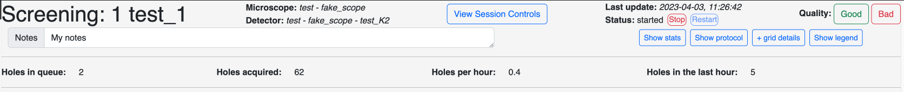
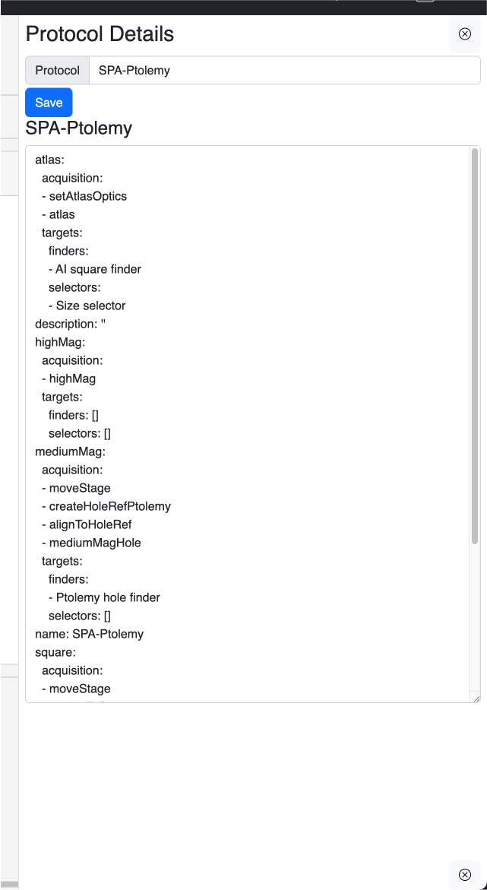
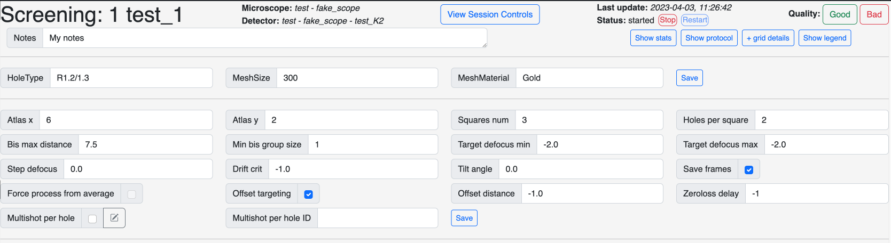

The status bar gives an overview of the grid and contains a few buttons to change settings.

On the first row, from left to right:
    
### Grid name with collection status

If the acquisition is in screening mode, the grid name will be prefexed by `Screening:`. If the [number of hole per square](/usage/preparation/setup_session/#automated-area-selection) is set to `0`, the prefix will be `Data Collection:`

### Microsopce and detector info

This shows the selected detector and microscope. This is mostly uselful when more than on microscope is connectect to SmartScope.

### Link to session control

This button will open a new tab to the session [controls and logs](/usage/preparation/run_session/)

### Last update and status

#### Last update

The last update timestamp is the last time anything had changed status on the grid.

#### Status

Here are the potential statuses:

* `null`: Grid is created but not started yet.
* `started`: Grid is actively being imaged
* `aborting`: Grid acquisition was cancelled
* `completed`: Grid acquisition was completed

Next to the status are 2 buttons:

* `Abort` [:material-pencil: Changed from Stop in 0.9.2](): Will remove all queued target from queue and change the grid status to `aborting` and skip to the next grid after the current action is completed.
* `Restart`: This is a way force the status an `aborted` or `completed` grid back to `started`. The next time the session will be started, it will go back to this grid.

!!! note "Restarting a grid"

    It is mainly used when a grid was completed too early and this button offers a way to go back to it. 
    
    Keep in mind that the registration will be off if the grid was unloaded from the stage. If that is the case, registration is usally good enough at the atlas level and adding new squares should work well. Adding holes to already acquired squares is not recommended.

#### Quality

This is a quick way to give a general ranking to a grid. Currently, the choice is binary: `Good` or `Bad`. Adding a quality label to a grid will color its name on the sidebar.

!!! tip

    This feature is useful when revisiting a session and trying to locate which grids were the good ones.

### Notes

This is a textbox to add any usefull comment about the grid.

[:material-pencil: Changed in 0.9]()

The notes now autosave after one second of not typing. We have removed the save button.

### Show stats

Togglable menu giving a few statistics about the size of the queue, number of acquisitions completed and rate of imaging.

### Show protocol

[:material-tag-outline: Added in 0.9]()

Will toggle the protocol sidebar and give details about the current protocol as well as the ability to change protocol.

!!! warning

    Changing the protocol of the current grid will require to stop and restart the session for changed to take effect. SmartScope should also let you know of that.

### Grid details

Allows to change the parameters that we specified during the creation of the session. Changing any of these should take effect immediately without requiring a restart of the session.

### Show legend

General options to toggle numbers and other parts of the maps cards images.

